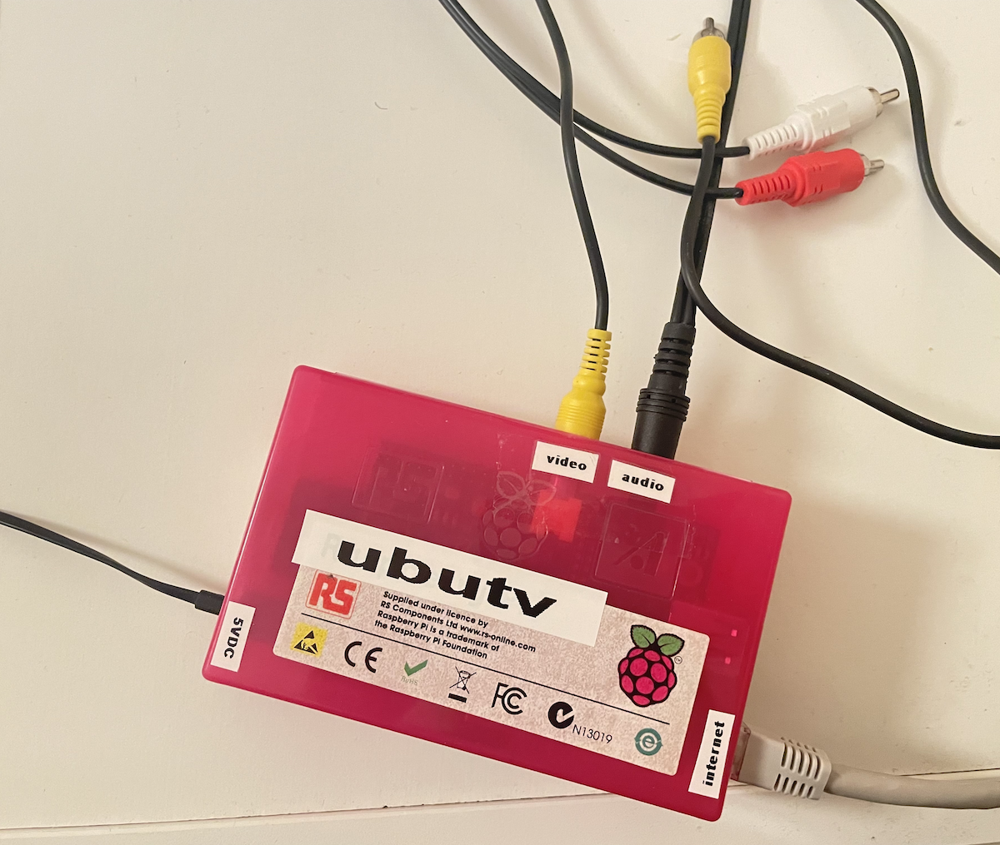

# ubutv

Fetches random videos from [ubu.com](https://www.ubu.com/film/index.html) and opens them in VLC.
Supports Linux and Mac.

For increased pleasure, consider running your scipt on a Raspberry Pi and plug that into 
your TV set:

 

# usage

First install [node](https://nodejs.org/en) and [VLC](https://www.videolan.org/vlc/) 
using your preferred method. Then to install and run:

```
cd ubutv
npm install
./ubutv.mjs
```

Or run with log stored in `ubutv.log`:

```
./ubutv.sh
```

# license

MIT
